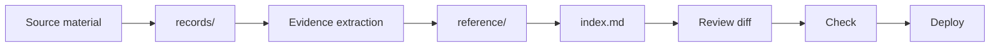

<p align="center">
  
</p>

<h1 align="center">PL Report Kit</h1>

<p align="center">
  <strong>Living strategic reports that PageLines agents can update through natural language.</strong>
</p>

<p align="center">
  Source-backed reports · natural-language editing · one-command publishing
</p>

---

PL Report Kit is a framework for building and maintaining strategic reports, research dossiers, client briefs, due-diligence notes, and document-backed analysis sites.

The point is not the docs engine. The point is that a report lives in a simple, structured workspace that a PageLines agent can safely edit. A non-technical user can ask for updates in plain language, review what changed, and publish without touching Git, Markdown, build tools, or hosting settings.

> "Add the new client interview, update the risks section, make the recommendation sharper, show me what changed, and put it live after I approve."

## 1, 2, 3: Live On The Internet

### 1. Make A Report

Use this repo as a template or ask a PageLines agent to create a new report from it.

```bash
npm install
npm run dev
```

Put source material in `records/` and edit the main report in `index.md`.

### 2. Tell PageLines What To Change

Ask in normal language:

```text
Read AGENTS.md first.
Add the transcript in records/.
Update the evidence matrix, rewrite the executive summary, and show me the diff.
```

The agent follows the repo rules, updates the right files, runs checks, and asks before publishing.

### 3. Put It Live

For the easiest Cloudflare Pages deploy, give the agent:

| Detail | Example | Why It Is Needed |
|---|---|---|
| Desired handle | `acme-strategy-report` | Creates `https://acme-strategy-report.pages.dev` |
| Cloudflare access | `npx wrangler login` or `CLOUDFLARE_API_TOKEN` | Lets the agent create and deploy the Pages project |
| Account ID | `CLOUDFLARE_ACCOUNT_ID` | Needed when the token can access multiple Cloudflare accounts |
| Optional password | `REPORT_PASSWORD` | Protects private reports with Basic Auth |

Then run:

```bash
npm run setup:cloudflare -- --project acme-strategy-report
```

For a private report:

```bash
npm run setup:cloudflare -- --project acme-strategy-report --password "use-a-strong-password"
```

After the first setup, publish updates with:

```bash
npm run deploy -- --project acme-strategy-report
```

The deploy helper creates the Pages project if needed, sets optional secrets, builds the report, deploys it, and prints the live `*.pages.dev` URL.

## Why This Exists

Important reports rarely start as clean documents. They start as transcripts, PDFs, spreadsheets, notes, links, screenshots, and half-finished summaries. A normal document editor helps with prose, but it does not preserve the evidence trail or give an AI agent a reliable way to update the work later.

PL Report Kit gives every report a durable shape:

- `records/` for raw source material
- `reference/` for extracted facts, evidence tables, and working synthesis
- `index.md` for the polished reader-facing report
- `overview.md` for the file map
- `AGENTS.md` for AI operating instructions
- `docs/formatting.md` for charts, diagrams, code, math, tabs, and media rules
- `CHANGELOG.md` for what changed and why

That structure is what makes natural-language editing reliable.

Built-in formatting support includes Markdown tables, Mermaid diagrams, Chart.js-powered `ReportChart` components, syntax-highlighted code blocks, code groups, MathJax equations, tabs, callouts, local search, and generated LLM-friendly output.

## PageLines Fit

PageLines is an adaptive-agent platform for owner-operated service teams: agencies, consultancies, fractional operators, boutique GTM teams, and high-touch client-service shops.

Those teams live in documents, meetings, email, and client updates. PL Report Kit gives their PageLines agents a clean workspace for turning scattered material into a polished report and keeping it current.

| Without the kit | With PL Report Kit + PageLines |
|---|---|
| Source material is scattered | Sources live in `records/` |
| AI summaries are one-off | Evidence is preserved in `reference/` |
| Non-technical users wait on developers | Users request edits in natural language |
| Publishing is manual | Agents can run checks and prepare deploys |
| Updates lose context | `AGENTS.md`, `overview.md`, and `CHANGELOG.md` preserve context |

## What You Can Build

- Strategic plans and market research reports
- Competitive or technical due diligence
- Client-facing research portals
- Meeting transcript synthesis
- Product discovery reports from interviews and tickets
- Board or investor briefings
- Internal decision memos with source evidence

## How It Works



The workflow is intentionally boring:

1. Add source material to `records/`.
2. Ask the PageLines agent to read `AGENTS.md`.
3. The agent extracts claims into `reference/evidence-matrix.md`.
4. The agent updates synthesis in `reference/research-notes.md`.
5. The agent revises the reader-facing report in `index.md`.
6. You review the diff.
7. The agent runs checks.
8. You approve deploy.

## What Users Need To Configure

Most reports need only a title, a handle, and source files.

| Need | Where It Lives | Can The Agent Handle It? |
|---|---|---|
| Report title and description | `.vitepress/config.mts`, `index.md` | Yes |
| Source documents | `records/` | Yes, if files are provided |
| Report structure | `index.md`, `reference/` | Yes |
| Pages handle | Cloudflare Pages project name | Yes, if user chooses a handle |
| Public/private choice | `REPORT_PASSWORD` | Yes, if user provides a password |
| Custom domain | Cloudflare dashboard or API | Usually, with Cloudflare account access |
| Ongoing updates | Report files + deploy command | Yes |

The one thing the user must provide is account access. The cleanest path is `npx wrangler login` on their machine. For agent-run automation, use a Cloudflare API token with Pages edit access and set `CLOUDFLARE_ACCOUNT_ID` when needed.

## Read Next

- [Report Kit Overview](report-kit-overview.md) - strategy, PageLines fit, principles, gotchas, charting, media, and definition of done
- [AI Workflow](docs/ai-workflow.md) - reusable prompt and processing checklist
- [Visual Formatting Guide](docs/formatting.md) - how agents should choose tables, charts, diagrams, code, math, tabs, callouts, and media
- [Writing Guide](GUIDE.md) - report structure, source standards, and quality checklist
- [AGENTS.md](AGENTS.md) - instructions AI agents should read before editing

## License

Use this as a starter kit for PageLines-powered reports, client work, internal strategy, and public research projects.
