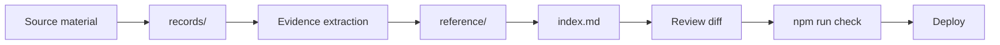

<p align="center">
  
</p>

<h1 align="center">PL Report Kit</h1>

<p align="center">
  <strong>Living strategic reports that PageLines agents can update through natural language.</strong>
</p>

<p align="center">
  Markdown reports · source-backed analysis · VitePress publishing · Cloudflare Pages deploys
</p>

---

PL Report Kit is an AI-ready framework for building and maintaining strategic reports, research dossiers, client briefs, due-diligence notes, and document-backed analysis sites.

The core idea: keep the report in a simple, structured repository so a PageLines agent can safely edit it. Non-technical users can ask for updates in plain language, review the diff, and publish without touching Git, Markdown, VitePress, or deployment settings.

> "Add the new client interview, update the risks section, make the recommendation sharper, show me what changed, and deploy it after I approve."

## Why This Exists

Important reports rarely start as clean documents. They start as transcripts, PDFs, spreadsheets, notes, links, screenshots, and half-finished summaries. A normal doc editor helps with prose, but it does not preserve the evidence trail or give an AI agent a reliable way to update the work later.

PL Report Kit gives every report a durable shape:

- `records/` for raw source material
- `reference/` for extracted facts, evidence tables, and working synthesis
- `index.md` for the polished reader-facing report
- `overview.md` for the file map
- `AGENTS.md` for AI operating instructions
- `CHANGELOG.md` for what changed and why

That structure is what makes natural-language editing reliable.

## PageLines Fit

PageLines is an adaptive-agent platform for owner-operated service teams: agencies, consultancies, fractional operators, boutique GTM teams, and high-touch client-service shops.

Those teams live in documents, meetings, email, and client updates. PL Report Kit gives their PageLines agents a clean workspace for turning scattered material into a polished report and keeping it current.

| Without the kit | With PL Report Kit + PageLines |
|---|---|
| Source material is scattered | Sources live in `records/` |
| AI summaries are one-off | Evidence is preserved in `reference/` |
| Non-technical users wait on developers | Users request edits in natural language |
| Publishing is manual | Agents can run checks and prepare deploys |
| Updates lose context | `AGENTS.md`, `overview.md`, and `CHANGELOG.md` preserve context |

## What You Can Build

- Strategic plans and market research reports
- Competitive or technical due diligence
- Client-facing research portals
- Meeting transcript synthesis
- Product discovery reports from interviews and tickets
- Board or investor briefings
- Internal decision memos with source evidence

## How It Works



The workflow is intentionally boring:

1. Add source material to `records/`.
2. Ask the PageLines agent to read `AGENTS.md`.
3. The agent extracts claims into `reference/evidence-matrix.md`.
4. The agent updates synthesis in `reference/research-notes.md`.
5. The agent revises the reader-facing report in `index.md`.
6. You review the diff.
7. The agent runs `npm run check`.
8. You approve deploy.

## Quick Start

```bash
npm install
npm run dev
```

Then edit:

- `index.md` for the main report
- `overview.md` for the file map
- `records/` for source documents
- `reference/` for synthesized notes and evidence
- `AGENTS.md` for AI agent instructions

## Cloudflare Pages

Recommended settings:

| Setting | Value |
|---|---|
| Build command | `npm run build` |
| Output directory | `.vitepress/dist` |

Direct deploy:

```bash
npm run deploy
```

Reports deploy publicly by default with `noindex` headers and robots rules. To protect a private report, set `REPORT_PASSWORD` in Cloudflare Pages environment variables. The middleware turns Basic Auth on only when that variable is present.

## Read Next

- [Report Kit Overview](report-kit-overview.md) - strategy, PageLines fit, principles, gotchas, charting, media, and definition of done
- [AI Workflow](docs/ai-workflow.md) - reusable prompt and processing checklist
- [Writing Guide](GUIDE.md) - report structure, source standards, and quality checklist
- [AGENTS.md](AGENTS.md) - instructions AI agents should read before editing

## License

Use this as a starter kit for PageLines-powered reports, client work, internal strategy, and public research projects.
