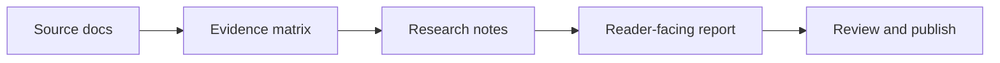

# Visual Formatting Guide

Use this guide when adding charts, diagrams, code, math, media, or structured research to a report.

The goal is not decoration. The goal is faster understanding with a clear evidence trail.

---

## Choose The Right Format

| Content Need | Use | Why |
|---|---|---|
| Exact values, decisions, evidence, risks | Markdown table | Tables preserve precision and scan well. |
| Workflow, system, dependency, journey | Mermaid | Diagrams clarify relationships and sequence. |
| KPI trend, ranking, comparison, distribution | `ReportChart` | Charts make shape and magnitude easier to see. |
| Formula, scoring model, simple equation | MathJax | Equations stay editable and readable. |
| Config, API, command, data sample | Fenced code block | Built-in syntax highlighting keeps technical content readable. |
| Alternative commands or configs | Code group | Readers compare options without duplicated prose. |
| Public/private or audience variants | Tabs | Useful for alternatives; do not hide core findings. |
| Assumption, warning, gotcha, decision rule | Callout | Makes risk visible without derailing the report. |
| Transcript, interview, source excerpt | `records/` plus evidence table | Raw source stays separate from polished synthesis. |

Default order: **table first, Mermaid second, `ReportChart` third**. Use a chart only when visual shape improves the decision.

---

## ReportChart

Use `ReportChart` for clean business charts from small, source-backed datasets.

```md
<ReportChart
  type="bar"
  title="Follow-up delay by source"
  description="Source: support export, 2026-06-15."
  series-label="Median delay"
  unit="hours"
  :horizontal="true"
  :labels="['Client calls', 'Slack asks', 'Email threads']"
  :values="[46, 31, 22]"
/>
```

Rules:

- Use `bar` for ranked comparisons.
- Use `line` for trends over time.
- Use `doughnut` only for simple composition with 2-5 slices.
- Put the source and date in nearby prose, chart description, or evidence table.
- Keep labels short; move explanation into the table below the chart.
- Do not chart more than 8 categories in the main report.
- If exact numbers matter, include a table near the chart.

---

## Mermaid

Use Mermaid for relationships, not precise business metrics.



Good uses:

- Workflow from source to report.
- Stakeholder or system map.
- Timeline with decision points.
- Architecture or data flow.

Avoid:

- Dense org charts.
- Large process maps.
- Exact numeric charts when `ReportChart` or a table is clearer.

---

## Code And Config

Always label fenced code blocks with a language.

````md
```bash
npm run check
```
````

Use code groups for alternatives:

````md
::: code-group

```bash [Deploy]
npm run deploy -- --project acme-report
```

```bash [Private]
npm run setup:cloudflare -- --project acme-report --private
```

:::
````

Use line highlighting when explaining important lines:

````md
```js{2}
export default {
  output: '.vitepress/dist',
}
```
````

---

## Math

Use equations for scoring models and compact decision logic.

```md
$$
priority = impact \times confidence \div effort
$$
```

Rules:

- Explain the variables immediately before or after the equation.
- Avoid equations when a sentence is clearer.
- Do not use math notation to make weak evidence look rigorous.

---

## Callouts

Use callouts for visible reader guidance.

```md
> [!IMPORTANT]
> This report contains private material. Set `REPORT_PASSWORD` as a Cloudflare Pages secret or use Cloudflare Access before publishing.
```

Use sparingly:

- `[!NOTE]` for context.
- `[!TIP]` for helpful next steps.
- `[!IMPORTANT]` for decision rules.
- `[!WARNING]` for risks.
- `[!CAUTION]` for possible harm or irreversible action.

---

## Tabs

Tabs are useful for variants, not primary conclusions.

```md
:::tabs key:publishing
== Public
Use for sanitized demos and public research.

== Private
Use for client work and internal reports. Run setup with `--private`.

== Sensitive
Use for medical, legal, financial, HR, regulated, or high-trust client material. Use Cloudflare Access.
:::
```

Do not put the executive summary, recommendation, or key risks behind tabs.

---

## Media And Transcripts

- Store raw transcripts in `records/`.
- Store large audio/video externally unless it is safe and small.
- Embed videos only when the media itself is evidence or a useful demo.
- Summarize media in `reference/research-notes.md`.
- Put extracted claims in `reference/evidence-matrix.md`.

---

## Agent Checklist

Before finishing a report update:

- [ ] The first screen has the conclusion and status.
- [ ] Every chart has labels, units, and source context.
- [ ] Tables carry exact values when precision matters.
- [ ] Mermaid diagrams are simple enough to scan in 10 seconds.
- [ ] Code blocks have language labels.
- [ ] Tabs do not hide primary findings.
- [ ] Major claims map to `reference/evidence-matrix.md`.
- [ ] `overview.md` and `CHANGELOG.md` are updated when structure or substance changes.
- [ ] `npm run check` passes.
