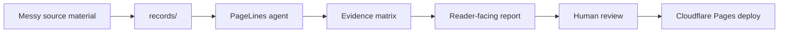

# Better Reports Brief

**Example report:** PL Report Kit<br>
**Audience:** Operators, consultants, researchers, and PageLines agents<br>
**Status:** Demo content with illustrative data<br>
**Updated:** June 15, 2026

---

## Executive Summary

PL Report Kit is strongest when a report needs to be **credible, updateable, and easy to publish**. It is not trying to replace every document, slide deck, dashboard, or CMS. It gives serious reports a source-backed workspace that AI agents can edit safely.

The practical win is simple: raw material goes into `records/`, claims move through `reference/`, the polished report stays in `index.md`, and PageLines agents can update the whole system from natural-language requests.

> [!IMPORTANT]
> This demo uses synthetic data to show the format. Replace the examples with source-backed numbers before using the report for a real decision.

---

## Decision Snapshot

| Question | Answer | Why It Matters |
|---|---|---|
| Best first use | Strategic and research reports | They need narrative, sources, visuals, and updates |
| Primary buyer pain | Reports go stale after the first draft | Agents can maintain the actual report files |
| Best PageLines fit | Non-technical users editing through natural language | The agent handles Markdown, Git, checks, and deploys |
| Default deploy | Public demo or private Cloudflare Pages site | Low setup cost with optional password protection |

---

## Approach Comparison

| Approach | AI Editability | Evidence Trail | Publishing | Best For |
|---|---:|---:|---:|---|
| Google Docs | 2 | 2 | 2 | Collaborative prose |
| PDF | 1 | 2 | 1 | Final static delivery |
| Slide deck | 2 | 1 | 2 | Live presentations |
| Notion page | 3 | 2 | 3 | Lightweight team notes |
| BI dashboard | 2 | 4 | 3 | Live metrics |
| Custom site | 3 | 3 | 4 | Polished web publishing |
| PL Report Kit | 5 | 5 | 5 | Living reports with source discipline |

<ReportChart
  type="bar"
  title="Illustrative report workflow score"
  description="Synthetic score from 1-5 across AI editability, evidence traceability, publishing speed, reader clarity, and maintenance cost."
  series-label="Composite score"
  unit="pts"
  :horizontal="true"
  :labels="['PL Report Kit', 'Custom site', 'BI dashboard', 'Notion page', 'Google Docs', 'Slide deck', 'PDF']"
  :values="[24, 17, 16, 15, 12, 11, 8]"
/>

The chart is intentionally a demo device. The point is not that the scores are universal. The point is that the report can combine narrative, a precise comparison table, a chart, and a source note in one maintainable artifact.

---

## Sales From Better Reports

Better reports sell because they reduce uncertainty. A prospect, client, or internal sponsor can see the answer, inspect the reasoning, and trust that the report can stay current.

| Sales Moment | Weak Report Behavior | Better Report Behavior |
|---|---|---|
| First impression | Static PDF or long doc | Clear web report with answer above the fold |
| Trust check | "Where did this come from?" | Evidence matrix and source trail |
| Follow-up | Manual rewrite | Agent updates sources, report, and changelog |
| Handoff | Context lost in chat | Repo keeps instructions, sources, and decisions |
| Expansion | One-off deliverable | Reusable report system for the next client |

Illustrative impact model:

$$
report\ leverage = clarity \times trust \times updateability
$$

If any one part is weak, the report becomes shelfware.

---

## How PageLines Changes The Workflow



The user does not need to understand the repo internals. They can ask:

> Add the new interview, update the comparison table, make the recommendation sharper, show me the diff, and publish after I approve.

The agent reads `AGENTS.md`, follows `docs/formatting.md`, updates the evidence trail, runs checks, and prepares the deploy.

---

## Recommended Demo Story

Use this report as the canonical demo for PL Report Kit:

| Section | Job |
|---|---|
| Executive summary | Show the point immediately |
| Approach comparison | Make alternatives easy to scan |
| Chart | Demonstrate visual support without a dashboard |
| PageLines workflow | Explain natural-language editing |
| Publishing shape | Show public/private deployment paths |
| Source trail | Teach where research and evidence belong |

The demo should feel like a working report, not a landing page pretending to be one.

---

## Risks And Controls

| Risk | Control |
|---|---|
| Demo data feels fake | Label it clearly and keep it useful |
| Report becomes sales copy | Keep the format analytical and source-oriented |
| Agents overuse charts | Require `docs/formatting.md` and nearby source context |
| Users publish private material | Use `REPORT_PASSWORD` and human approval |
| Custom domain setup stalls | Keep the `*.pages.dev` URL live while DNS validates |

---

## Open Questions

- Should the default demo stay synthetic, or include one real public PageLines case study later?
- Should `report-kit-demo.pagelines.com` remain the canonical demo URL?
- Should PageLines agents offer a "make this report sharper" standing order by default?
- Should the starter include optional example CSV files for richer chart demos?

---

## Publishing Shape

:::tabs key:publishing
== Public Demo
Use for the canonical PL Report Kit example. Keep data synthetic or public and deploy without `REPORT_PASSWORD`.

== Private Report
Use for client work, internal decisions, diligence, and research with sensitive source material. Set `REPORT_PASSWORD` before deploy.
:::

::: code-group

```bash [Deploy]
npm run deploy -- --project pl-report-kit-demo
```

```txt [Private]
REPORT_PASSWORD=use-a-strong-password
REPORT_REALM="Better Reports Brief"
```

:::

---

## Source Trail

This is demo content. A real report should replace these rows with actual source files:

| Source Type | Put It In | Agent Output |
|---|---|---|
| User interviews | `records/interview-YYYY-MM-DD-topic.md` | Jobs, objections, proof points |
| Research notes | `records/research-notes-YYYY-MM-DD.md` | Claims and implications |
| Comparison data | `records/comparison-data.csv` | Tables and charts |
| Evidence table | `reference/evidence-matrix.md` | Claim-to-source map |
| Synthesis | `reference/research-notes.md` | Patterns, recommendations, open questions |
