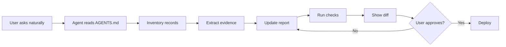

# Why Report Kit

**Example report:** PL Report Kit<br>
**Audience:** Consultants, operators, analysts, founders, careful families, and PageLines agents<br>
**Status:** Demo report with synthetic examples<br>
**Updated:** June 16, 2026

---

## Short Version

Most serious reports do not start as reports.

They start as call notes, PDFs, spreadsheets, screenshots, patient records, Slack threads, old decks, and someone saying, "Can we turn this into something clear?"

Report Kit is built for that moment. It gives the work a simple structure: raw material goes in `records/`, evidence and synthesis live in `reference/`, the polished report lives in `index.md`, and a PageLines agent can update the whole thing from natural-language requests.

The payoff is not fancy tooling. The payoff is that the report stays understandable, source-backed, editable, and publishable after the first draft.

> [!IMPORTANT]
> This demo uses synthetic examples to show the format. Replace example data with source-backed facts before using a report for a real decision. For medical, legal, financial, client, or internal material, use the privacy guidance before publishing.

---

## Decision Snapshot

| Question | Answer | Why It Matters |
|---|---|---|
| Best first use | Strategic, research, client, and personal evidence reports | These reports need narrative, source discipline, and updates |
| Primary pain | Source material gets scattered and the report goes stale | The kit keeps sources, claims, edits, and deploys in one workspace |
| Why PageLines fits | Non-technical users can request edits naturally | The agent handles files, Markdown, checks, diffs, and deploy prep |
| Default publishing | Cloudflare Pages | Public by default, private with a secret, sensitive with Access |
| Real strength | A coding agent can edit the actual report system | It can change files, run checks, show diffs, and keep evidence attached |

---

## The Situation

Important knowledge usually arrives in annoying shapes.

| Input | What The User Wants | What Usually Happens |
|---|---|---|
| Meeting transcripts | "Find the pattern and update the plan." | Good quotes disappear into chat history |
| Patient records | "Summarize the timeline and questions for the doctor." | Details stay trapped across PDFs and portals |
| Competitor research | "Compare this with what sales is hearing." | Public facts and internal notes never meet cleanly |
| Strategy docs | "Turn the messy draft into an executive brief." | The final doc loses the source trail |
| Diligence files | "Show the risks and what we still need to verify." | Open questions get mixed with conclusions |

The hard part is not writing paragraphs. The hard part is preserving enough structure that the report can be trusted and updated later.

---

## The Problem

Common tools each solve part of the job.

| Approach | Good At | Breaks When |
|---|---|---|
| Google Docs | Collaborative prose | Evidence, source files, and deploy workflow matter |
| PDF | Final delivery | Anything changes |
| Slide deck | Presentations | The reader needs detail and source context |
| ChatGPT thread | Fast synthesis | The work needs to become a durable artifact |
| Notion page | Team notes | The report needs tests, deployment, and agent-safe conventions |
| Dashboard | Live metrics | The decision also needs narrative, judgment, and sources |

The result is familiar: a report looks good for one week, then new data arrives, someone asks where a claim came from, and the update becomes a mini project.

---

## Why It Gets Expensive

The waste is mostly hidden.

<ReportChart
  type="bar"
  title="Where report work usually burns time"
  description="Synthetic example showing recurring friction in messy report workflows."
  series-label="Friction score"
  unit="pts"
  :horizontal="true"
  :labels="['Finding source material', 'Rewriting stale sections', 'Checking claims', 'Publishing updates', 'Explaining what changed']"
  :values="[8, 9, 7, 6, 7]"
/>

The exact numbers are invented for the demo. The pattern is not. Reports get expensive when every update requires rediscovering the context.

---

## What Report Kit Changes

Report Kit treats the report as a small, legible project instead of a loose document.

| Layer | File Or Folder | Job |
|---|---|---|
| Source | `records/` | Keep raw material auditable |
| Evidence | `reference/evidence-matrix.md` | Connect claims to sources, dates, and certainty |
| Synthesis | `reference/research-notes.md` | Capture patterns, contradictions, and implications |
| Report | `index.md` | Give readers the sharp version |
| Instructions | `AGENTS.md`, `GUIDE.md`, `docs/` | Tell AI agents how to work without guessing |
| Operations | `CHANGELOG.md`, tests, deploy scripts | Make updates reviewable and publishable |

This is why coding agents are unusually good at the job. They can edit the same files humans read, preserve the structure, run checks, and show the diff before anything goes live.

---

## Where It Fits

| Use Case | Source Material | Useful Output | Privacy Mode |
|---|---|---|---|
| Strategic report | Interviews, metrics, market notes, old plans | Decision memo with risks and next steps | Public or private |
| Competitive research | Pricing pages, screenshots, sales notes, internal win/loss data | Competitor brief with evidence and gaps | Private |
| Client research portal | Calls, proposals, project docs, deliverables | Living web report clients can revisit | Private or sensitive |
| Medical issue research | Patient records, labs, visit notes, questions | Timeline, source summary, doctor prep questions | Sensitive |
| Due diligence | PDFs, calls, financial exports, web research | Risk/opportunity report with open questions | Private or sensitive |
| Product discovery | Interviews, tickets, analytics exports | JTBD map, feature themes, roadmap evidence | Private |

For medical and other high-stakes personal research, the kit should organize records and questions. It should not pretend to replace professional judgment.

---

## How PageLines Makes It Work

The user does not need to know Markdown, Git, Cloudflare, VitePress, or where the evidence matrix lives.

They can ask:

> Add the new interview, update the risks section, make the recommendation sharper, show me what changed, and publish after I approve.

The PageLines agent turns that into a controlled workflow.



That is the PageLines fit: non-technical editing on top of real files, real checks, and real publishing controls.

---

## Compared With The Usual Options

| Option | Source Trail | Agent Editing | Web Publishing | Good Fit |
|---|---:|---:|---:|---|
| Chat thread | 1 | 2 | 1 | Brainstorming |
| PDF | 2 | 1 | 1 | Final static handoff |
| Google Docs | 2 | 2 | 2 | Collaborative drafting |
| Notion page | 3 | 3 | 3 | Team notes |
| Custom app | 4 | 3 | 5 | Productized portals |
| Report Kit | 5 | 5 | 5 | Living research and strategy reports |

<ReportChart
  type="bar"
  title="Why the kit is easier for agents to maintain"
  description="Synthetic 1-5 score across source trail, agent editing, publishing, privacy controls, and reader clarity."
  series-label="Report Kit"
  unit="pts"
  :horizontal="true"
  :labels="['Source trail', 'Agent editing', 'Publishing', 'Privacy controls', 'Reader clarity']"
  :values="[5, 5, 5, 4, 4]"
/>

The kit is not always the right answer. A one-page announcement can stay in a doc. A pure metrics product should probably be a dashboard. Report Kit is for research and strategy work where sources, writing, visuals, updates, and publishing all matter.

---

## Privacy Modes

| Mode | Use For | Setup | Notes |
|---|---|---|---|
| Public | Demos, public research, marketing resources | No `REPORT_PASSWORD` | Do not include private source material |
| Private | Client portals, internal reports, diligence | Set `REPORT_PASSWORD` as a Cloudflare Pages secret | Real edge auth with one shared password |
| Sensitive | Medical, legal, financial, HR, regulated, or high-trust client work | Use Cloudflare Access plus a private repo | Named users, identity login, MFA/audit options |

`noindex` is useful, but it is not security. For anything sensitive, protect the site before publishing and keep the source repo private.

---

## Publishing Shape

:::tabs key:publishing
== Public
Use this for demo reports and public resources.

```bash
npm run setup:cloudflare -- --project acme-report
```

== Private
Use this for shared-password reports. Wrangler prompts securely for the password.

```bash
npm run setup:cloudflare -- --project acme-report --private
```

== Sensitive
Use this when the source material should only be available to named people.

```text
Use a private GitHub repo, a custom domain, and Cloudflare Access.
Give the agent Cloudflare/GitHub permissions, but keep human approval before publishing.
```
:::

::: code-group

```txt [Agent request]
Read AGENTS.md first.
Add the new source files in records/.
Update the evidence matrix, rewrite the recommendation, run checks, and show me the diff before deploy.
```

```txt [Local private test]
REPORT_PASSWORD="local-dev-password"
REPORT_REALM="Acme Report"
```

```txt [Cloudflare secret]
REPORT_PASSWORD is stored with wrangler pages secret put.
Do not commit it to the repo.
```

:::

---

## Source Trail

This demo is intentionally small. A real report should replace these rows with actual source files.

| Source Type | Put It In | Agent Output |
|---|---|---|
| Transcript | `records/transcript-YYYY-MM-DD-topic.md` | Claims, quotes, themes, open questions |
| PDF or record export | `records/source-YYYY-MM-DD-name.pdf` | Timeline entries and evidence rows |
| Spreadsheet or CSV | `records/data-YYYY-MM-DD-topic.csv` | Tables, charts, caveats |
| Web research | `records/web-research-YYYY-MM-DD-topic.md` | Dated source list and extracted facts |
| Internal notes | `records/internal-notes-YYYY-MM-DD-topic.md` | Inferences marked separately from facts |

The habit matters more than the format: keep the raw thing, extract the claim, show the source, then write the answer.
