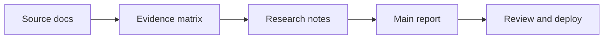

# Example Strategic Report

**Topic:** AI support automation readiness  
**Audience:** Executive team  
**Status:** Example content to replace  
**Updated:** June 15, 2026

---

## Executive Summary

The strongest near-term opportunity is automating tier-1 support triage, not full ticket resolution. The example evidence points to high ticket volume, repeated request types, and low-risk workflows where AI can draft responses, route issues, and surface missing customer context.

The recommended first deployment is a 30-day internal pilot over historical transcripts and current low-risk tickets. Human review stays in the loop until accuracy, escalation quality, and customer satisfaction are measured.

---

## Current Situation

| Signal | Example Finding | Implication |
|---|---:|---|
| Monthly support tickets | 4,200 | Enough volume for measurable automation ROI |
| Repeated categories | 61% of tickets | Good candidate for triage and draft replies |
| Missing context delays | 28% of tickets | AI can prefill account and product context |
| Regulatory exposure | Low for tier-1 | Start here before sensitive workflows |

---

## Key Findings

1. **Triage is the best first use case.** It has repeated patterns, clear routing labels, and lower downside than autonomous resolution.
2. **The data is usable but messy.** Transcripts need account IDs, product area tags, and resolution labels normalized before evaluation.
3. **Human review should remain mandatory at launch.** The first goal is faster staff work, not replacing support judgment.
4. **Measurement should start before deployment.** Baseline response time, handle time, escalation rate, and CSAT are needed.

---

## Recommended Rollout

| Phase | Duration | Output | Exit Criteria |
|---|---:|---|---|
| Source audit | 1 week | Clean sample set and evidence matrix | 500 labeled tickets ready |
| Offline evaluation | 1 week | Accuracy and routing scorecard | 90% correct triage on low-risk categories |
| Internal pilot | 2 weeks | Agent assist in review mode | Faster handle time with no CSAT drop |
| Limited production | 4 weeks | Human-approved customer replies | Escalation quality holds steady |

---

## Risks And Controls

| Risk | Control |
|---|---|
| Wrong routing | Keep low-confidence tickets in manual queue |
| Hallucinated policy claims | Ground replies in approved knowledge base |
| Sensitive customer data exposure | Restrict model inputs and log access |
| Weak measurement | Capture before/after metrics before pilot |

---

## Open Questions

- Which support categories have the cleanest historical labels?
- What customer data can be safely included in the AI context?
- Who approves the final response style and escalation policy?
- What accuracy threshold is required before expanding beyond triage?

---

## Source Trail

This example report is intentionally generic. Replace it with findings from:

- Source documents in `records/`
- Extracted claims in `reference/evidence-matrix.md`
- Synthesized notes in `reference/research-notes.md`

