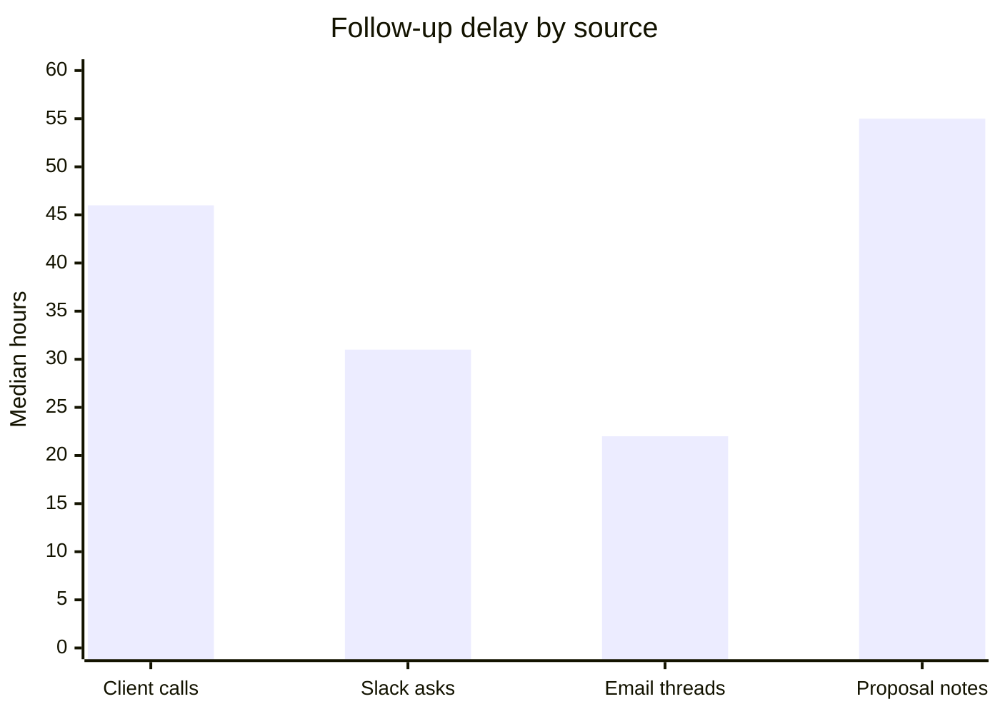
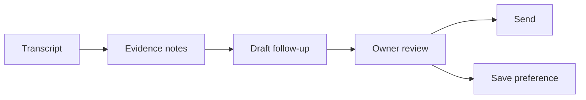

# Client Ops Automation Brief

**Example report:** Harbor Studio 
**Audience:** Owner + ops lead 
**Status:** Demo content to replace 
**Updated:** June 15, 2026

---

## Executive Summary

Harbor Studio should start with **client follow-up automation**, not a broad "AI transformation" project. The workflow is frequent, source material is clean, and human approval keeps client trust intact.

The first release should turn call transcripts, Slack notes, and account context into draft follow-ups within 24 hours. PageLines handles the report updates the same way: source material goes in, the agent extracts evidence, the owner reviews the diff, and the report goes live after approval.

---

## Decision Snapshot

| Question | Answer | Evidence |
|---|---|---|
| Best first workflow | Client follow-up drafts | High volume, low-risk approval loop |
| Deployment model | Human-in-the-loop | Client-facing sends require approval |
| First success metric | Follow-up sent within 24 hours | Current median is 46 hours |
| First release size | 30-day pilot | Enough volume without process sprawl |

---

## Current Signals

| Signal | Finding | Why It Matters |
|---|---:|---|
| Client calls per month | 84 | Enough repetition for a measurable pilot |
| Follow-ups later than 24h | 57% | Clear service-quality gap |
| Reusable response patterns | 6 | Good fit for agent-drafted templates |
| Required owner approvals | 100% | Automation can assist without auto-sending |

---

## Recommended Pilot

| Phase | Output | Exit Criteria |
|---|---|---|
| Source cleanup | 50 recent calls tagged by client and outcome | Agent can find the right context |
| Draft pilot | Follow-up drafts for 10 active clients | Owner edits less than 30% of draft text |
| Preference capture | Saved tone, next-step, and escalation rules | Agent names what it learned |
| Live rollout | Drafts generated after each client call | Median follow-up time under 24h |

---

## Recommendation

Start with a narrow PageLines standing order:

> After every client call transcript lands in `records/`, extract commitments, draft the follow-up, update the evidence matrix, and ask the owner before sending or publishing.

This is the right first slice because it creates personal value, shows visible adaptation, and gives teammates a concrete reason to trust the agent.

---

## Risks And Controls

| Risk | Control |
|---|---|
| Draft promises work the team cannot do | Require owner approval before send |
| Transcript misses a key commitment | Mark uncertain transcript sections in the evidence table |
| Client tone feels generic | Save approved edits as style preferences |
| Report drifts from source material | Keep every claim tied to `reference/evidence-matrix.md` |

---

## Open Questions

- Which transcript source should be treated as authoritative?
- Which clients should be excluded from the pilot?
- What commitments require owner approval versus team approval?
- Should the report be public, private behind `REPORT_PASSWORD`, or client-specific?

---

## Source Trail

This is demo content. Replace it with real source material:

| Source Type | Put It In | Agent Output |
|---|---|---|
| Call transcript | `records/transcript-YYYY-MM-DD-client.md` | Commitments and next steps |
| Support export | `records/support-export-YYYY-MM-DD.csv` | Trend table and chart |
| Strategy notes | `records/strategy-notes.md` | Recommendation and risks |
| Evidence table | `reference/evidence-matrix.md` | Claim-to-source map |
